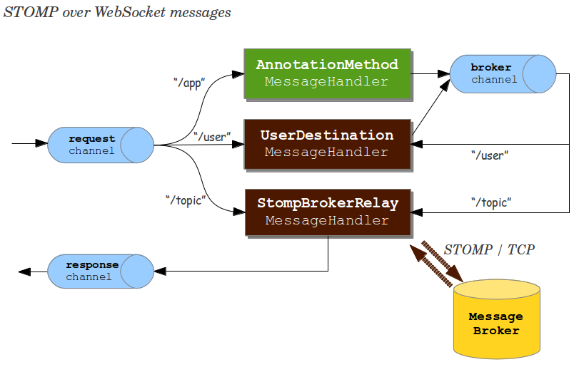

!SLIDE smaller bullets incremental
# STOMP over WebSocket
## Spring Framework 4.0
  
* Trivial to configure
* Application becomes STOMP broker to clients
* Subscriptions automatically processed via "simple" broker by default
* Applications can handle messages via annotated methods

!SLIDE smaller
# Basic Configuration

    @@@ java

    @Configuration
    @EnableWebSocketMessageBroker
    public class Config 
        implements WebSocketMessageBrokerConfigurer {

      @Override
      public void registerStompEndpoints(StompEndpointRegistry r){

      }

      @Override
      public void configureMessageBroker(MessageBrokerConfigurer c){

      }

    }

!SLIDE smaller
# Basic Configuration

    @@@ java

    @Configuration
    @EnableWebSocketMessageBroker
    public class Config
        implements WebSocketMessageBrokerConfigurer {

      @Override
      public void registerStompEndpoints(StompEndpointRegistry r){
        r.addEndpoint("/stomp");
      }

      @Override
      public void configureMessageBroker(MessageBrokerConfigurer c){

      }

    }

!SLIDE smaller
# Basic Configuration

    @@@ java

    @Configuration
    @EnableWebSocketMessageBroker
    public class Config
        implements WebSocketMessageBrokerConfigurer{

      @Override
      public void registerStompEndpoints(StompEndpointRegistry r){
        r.addEndpoint("/stomp");
      }

      @Override
      public void configureMessageBroker(MessageBrokerConfigurer c){
        c.enableSimpleBroker("/topic/");

      }

    }

!SLIDE smaller
# Basic Configuration

    @@@ java

    @Configuration
    @EnableWebSocketMessageBroker
    public class Config
        implements WebSocketMessageBrokerConfigurer{

      @Override
      public void registerStompEndpoints(StompEndpointRegistry r){
        r.addEndpoint("/stomp");
      }

      @Override
      public void configureMessageBroker(MessageBrokerConfigurer c){
        c.enableSimpleBroker("/topic/");
        c.setApplicationDestinationPrefixes("/app");
      }

    }

!SLIDE center

!SLIDE smaller
# Handle a Message
 
    @@@ java

    @Controller
    public class GreetingController {

      @MessageMapping("/greetings")
      public void handle(String greeting) {
        // ...
      }

    }

!SLIDE smaller bullets incremental
# `@MessageMapping`

* Supported on type- and method-level
* Mappings support Ant-style patterns and URI variables with `@PathVariable` arguments
* Various methods arguments `@Header/@Headers`, `@Payload`, `Message`, `Principal`

!SLIDE smaller bullets incremental
# `@MessageMapping`
## Return Values
  
* Return value converted and wrapped as message
* Broadcast to same destination but with default prefix of `"/topic"` (configurable)
* Use `@SendTo` to specify different destination(s)

!SLIDE smaller
# Handle Message
## with Return Value
 
    @@@ java

    @Controller
    public class GreetingController {

      @MessageMapping("/greetings")
      public String greet(String greeting) {
          return "[" + getTimestamp() + "]: " + greeting;
      }

    }

!SLIDE smaller
# Handle Message
## with Return Value
 
    @@@ java

    @Controller
    public class GreetingController {

      // message broadcast to "/topic/greetings"

      @MessageMapping("/greetings")
      public String greet(String greeting) {
          return "[" + getTimestamp() + "]: " + greeting;
      }

    }

!SLIDE smaller
# Handle Message
## with Return Value
 
    @@@ java

    @Controller
    public class GreetingController {

      @MessageMapping("/greetings")
      @SendTo("/topic/wishes")
      public String greet(String greeting) {
          return "[" + getTimestamp() + "]: " + greeting;
      }

    }

!SLIDE smaller
# Send with `SimpMessagingTemplate`

    @@@ java

    @Controller
    public class GreetingController {

      @Autowired
      private SimpMessagingTemplate template;

      @RequestMapping(value="/greetings", method=POST)
      public void greet(String greeting) {
        String text = "[" + getTimeStamp() + "]:" + greeting;
        this.template.convertAndSend("/topic/wishes", text);
      }

    }

!SLIDE smaller
# Handle Subscription
## (Request-Reply Pattern)

    @@@ java

    @Controller
    public class PortfolioController {

      @SubscribeEvent("/positions")
      public List<Position> getPositions(Principal p) {
        Portfolio portfolio = ...
        return portfolio.getPositions();
      }

    }

!SLIDE smaller bullets incremental
# Plug in Message Broker
  
* "Simple" broker great for getting started
* Supports only subset of STOMP (no acks, receipts)
* Relies on simple message sending loop
* Not suitable for clustering

!SLIDE smaller bullets incremental
# Steps to Use Message Broker
 
* Check broker STOMP page, e.g. [RabbitMQ](http://www.rabbitmq.com/stomp.html), [ActiveMQ](http://activemq.apache.org/stomp.html)
* Install and run broker with STOMP support
* Enable STOMP __"broker relay"__ in Spring
* Messages now broadcast via message broker

!SLIDE smaller
# Enable "Broker Relay"

    @@@ java

    @Configuration
    @EnableWebSocketMessageBroker
    public class Config
        implements WebSocketMessageBrokerConfigurer{

      @Override
      public void configureMessageBroker(MessageBrokerConfigurer c){

      }

    }

!SLIDE smaller
# Enable "Broker Relay"

    @@@ java

    @Configuration
    @EnableWebSocketMessageBroker
    public class Config
        implements WebSocketMessageBrokerConfigurer{

      @Override
      public void configureMessageBroker(MessageBrokerConfigurer c){
        c.enableStompBrokerRelay("/queue/", "/topic/");

      }

    }

!SLIDE smaller
# Enable "Broker Relay"

    @@@ java

    @Configuration
    @EnableWebSocketMessageBroker
    public class Config
        implements WebSocketMessageBrokerConfigurer{

      @Override
      public void configureMessageBroker(MessageBrokerConfigurer c){
        c.enableStompBrokerRelay("/queue/", "/topic/");
        c.setApplicationDestinationPrefixes("/app");
      }

    }

!SLIDE center

!SLIDE smaller bullets incremental
# Authentication

* STOMP `CONNECT` frame has authentication headers
* Over WebSocket we can use HTTP
* Protect application as usual, e.g. Spring Security
* All messages enriched with "user" header

!SLIDE smaller bullets incremental
# `"/user"` Destinations

* Special Spring-supported destination semantics
* Makes it easy to create uniquely named, per-user queues
* Useful for receiving error or any user-specific info (e.g. trade confirmation)

!SLIDE smaller bullets incremental
# Client Subscribes To
# `"/user/queue/..."`

    @@@ javascript

    var socket = new SockJS('/myapp/portfolio');
    var client = Stomp.over(socket);

    client.connect('', '', function(frame) {

      client.subscribe("/user/queue/trade-confirm",function(msg){
        // ...
      });

      client.subscribe("/user/queue/errors",function(msg){
        // ...
      });

    }

!SLIDE smaller
# Controller Sends Error

    @@@ java

    @Controller
    public class GreetingController {

      @MessageExceptionHandler
      @SendToUser("/queue/errors")
      public String handleException(IllegalStateException ex) {
        return ex.getMessage();
      }

    }

!SLIDE smaller
# Send To User
## via `SimpMessagingTemplate`

    @@@ java
    @Service
    public class TradeService {

      @Autowired
      private SimpMessagingTemplate template;

      public void executeTrade(Trade trade) {
        String user = trade.getUser();
        String dest = "/queue/trade-confirm";
        TradeResult result = ...
        this.template.convertAndSendToUser(user, dest, result);
      }

    }

!SLIDE smaller bullets incremental
# `UserDestinationHandler`

* Translates `"/user/..."` destinations
* Appends per-user unique identifier to queue name
* Ensures no collision with other users

!SLIDE center

!SLIDE smaller bullets incremental
# Managing Inactive Queues
## _(full-featured brokers)_
  
* Check broker documentation
* For example RabbitMQ creates auto-delete queue with destinations like `"/exchange/amq.direct/a"`
* ActiveMQ has [config options](http://activemq.apache.org/delete-inactive-destinations.html) to purge inactive destinations

