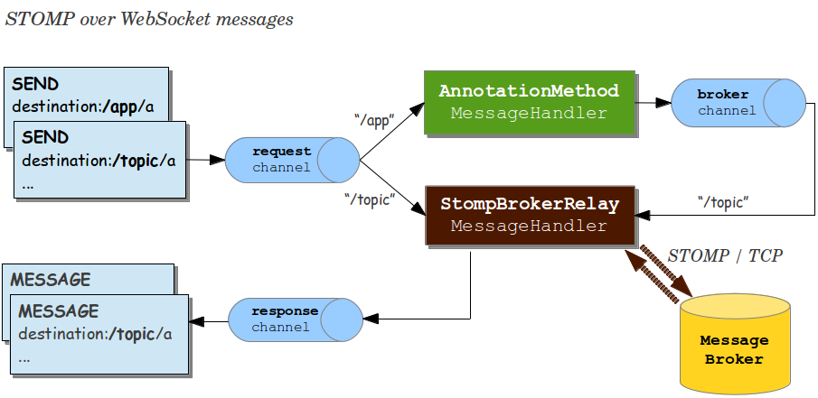

!SLIDE smaller bullets incremental
# STOMP over WebSocket
## Spring Framework 4.0
  
* It's trivial to turn on
* Application becomes STOMP broker to clients
* Automatically handles subscriptions via "simple" broker by default
* Applications can also handle and send messages

!SLIDE smaller
# Basic Configuration

    @@@ java

    @Configuration
    @EnableWebSocketMessageBroker
    public class Config implements WebSocketMessageBrokerConfigurer{

      @Override
      public void registerStompEndpoints(StompEndpointRegistry r){

      }

      @Override
      public void configureMessageBroker(MessageBrokerConfigurer c){

      }

    }

!SLIDE smaller
# Basic Configuration

    @@@ java

    @Configuration
    @EnableWebSocketMessageBroker
    public class Config implements WebSocketMessageBrokerConfigurer{

      @Override
      public void registerStompEndpoints(StompEndpointRegistry r){
        r.addEndpoint("/stomp");
      }

      @Override
      public void configureMessageBroker(MessageBrokerConfigurer c){

      }

    }

!SLIDE smaller
# Basic Configuration

    @@@ java

    @Configuration
    @EnableWebSocketMessageBroker
    public class Config implements WebSocketMessageBrokerConfigurer{

      @Override
      public void registerStompEndpoints(StompEndpointRegistry r){
        r.addEndpoint("/stomp");
      }

      @Override
      public void configureMessageBroker(MessageBrokerConfigurer c){
        c.enableSimpleBroker("/topic/");

      }

    }

!SLIDE smaller
# Basic Configuration

    @@@ java

    @Configuration
    @EnableWebSocketMessageBroker
    public class Config implements WebSocketMessageBrokerConfigurer{

      @Override
      public void registerStompEndpoints(StompEndpointRegistry r){
        r.addEndpoint("/stomp");
      }

      @Override
      public void configureMessageBroker(MessageBrokerConfigurer c){
        c.enableSimpleBroker("/topic/");
        c.setApplicationDestinationPrefixes("/app");
      }

    }

!SLIDE center

!SLIDE smaller
# Handling a Message
 
    @@@ java

    @Controller
    public class GreetingController {

      @MessageMapping("/greetings")
      public void handle(String greeting) {
        // ...
      }

    }

!SLIDE smaller
# Broadcasting
## via Method Return Value
 
    @@@ java

    @Controller
    public class GreetingController {

      @MessageMapping("/greetings")
      @SendTo("/topic/greetings")
      public String greet(String greeting) {
          return "[" + getTimestamp() + "]: " + greeting;
      }

    }

!SLIDE smaller bullets incremental
# Broadcasting
## via Messaging Template

    @@@ java

    @Controller
    public class GreetingController {

      @Autowired
      private SimpMessagingTemplate template;

      @RequestMapping(value="/greeting", method=POST)
      public void greet(String greeting) {
        String text = "[" + getTimeStamp() + "]:" + greeting;
        this.template.convertAndSend("/topic/greeting", text);
      }

    }

!SLIDE smaller
# Responding to Subscription
## Request-Reply Pattern

    @@@ java

    @Controller
    public class PortfolioController {

      @SubscribeEvent("/positions")
      public List<PortfolioPosition> getPositions(Principal user) {
        Portfolio portfolio = ...
        return portfolio.getPositions();
      }

    }

!SLIDE smaller bullets incremental
# Plugging in
## A Full-Featured Message Broker
  
* "Simple" broker supports subset of STOMP (`SUBSCRIBE`, `UNSUBSCRIBE`, `MESSAGE`)
* No acks and receipts
* Relies on simple message sending loop
* Not suitable for clustering

!SLIDE smaller
# Configure Message Broker

    @@@ java

    @Configuration
    @EnableWebSocketMessageBroker
    public class Config implements WebSocketMessageBrokerConfigurer{

      @Override
      public void configureMessageBroker(MessageBrokerConfigurer c){

      }

    }

!SLIDE smaller
# Configure Message Broker

    @@@ java

    @Configuration
    @EnableWebSocketMessageBroker
    public class Config implements WebSocketMessageBrokerConfigurer{

      @Override
      public void configureMessageBroker(MessageBrokerConfigurer c){
        c.enableStompBrokerRelay("/queue/", "/topic/");

      }

    }

!SLIDE smaller
# Configure Message Broker

    @@@ java

    @Configuration
    @EnableWebSocketMessageBroker
    public class Config implements WebSocketMessageBrokerConfigurer{

      @Override
      public void configureMessageBroker(MessageBrokerConfigurer c){
        c.enableStompBrokerRelay("/queue/", "/topic/");
        c.setApplicationDestinationPrefixes("/app");
      }

    }

!SLIDE smaller bullets incremental
# Running Message Broker

* Check broker STOMP page ([RabbitMQ](http://www.rabbitmq.com/stomp.html), [ActiveMQ](http://activemq.apache.org/stomp.html))
* Understand destination semantics
* Plus any additional features it may offer usually via broker-specific headers
* Broadcasting of messages now backed by message broker

!SLIDE center

